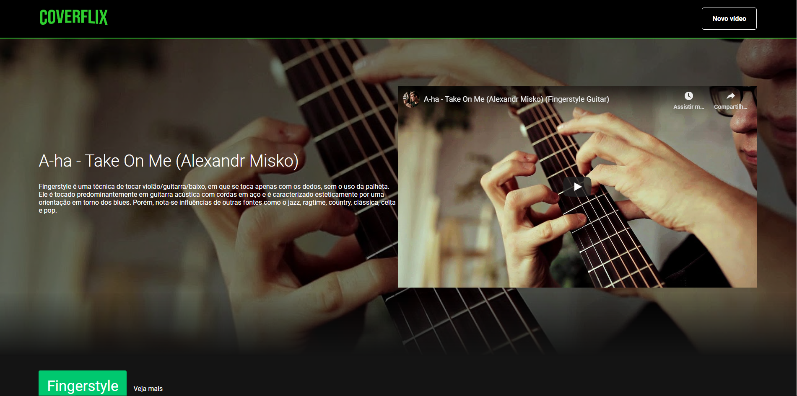

<h1 align="center">
    Coverflix
</h1>

  <a href="#-projeto">Projeto</a>&nbsp;&nbsp;&nbsp;|&nbsp;&nbsp;&nbsp;
   <a href="#-features-e-tecnologias">Features e Tecnologias</a>&nbsp;&nbsp;&nbsp;|&nbsp;&nbsp;&nbsp;
  <a href="#-como-contribuir">Como contribuir</a>

  

###  💻 Projeto

A [Coverflix](https://coverflix.vercel.app) é uma plataforma baseada na Netflix para exibição de covers de vários artistas e estilos musicais.

A primeira versão desse projeto foi desenvolvida em paralelo a Imersão React da [Alura](https://www.alura.com.br/).

### 🚀 Features e Tecnologias

Esse projeto foi desenvolvido com [React](https://pt-br.reactjs.org/).

As seguintes features estão/vão estar inclusas no projeto:

- [x] Listagem Principal
- [x] Cadastro de Categoria
- [x] Cadastro de vídeo
- [ ] Edição/Exclusão dos cadastros
- [ ] Listagem personalizada
- [ ] Exibição interna do vídeo
- [ ] Ferramenta de busca

  

## 🤔 Como contribuir

- Faça um fork desse repositório;
- Cria uma branch com a sua feature: `git checkout -b minha-feature`;
- Faça commit das suas alterações: `git commit -m 'feat: Minha nova feature'`;
- Faça push para a sua branch: `git push origin minha-feature`.

Depois que o merge da sua pull request for feito, você pode deletar a sua branch.

